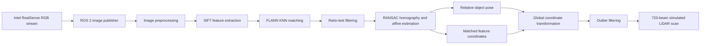

# Vision-Based Simulated LiDAR for Tabletop Robotics

[](LICENSE)
[](https://docs.ros.org/)
[](https://opencv.org/)

A research prototype that uses monocular RGB imagery, feature matching, and
geometric transformations to estimate the relative pose of objects in a
tabletop environment and generate LiDAR-like range measurements.

The project combines ROS 2, an Intel RealSense camera, OpenCV, and Python. It
was developed to explore whether visual features could provide a lightweight
substitute for physical LiDAR in small-scale robotics experiments involving a
Cozmo robot, movable objects, and goal locations.

## Project Overview

The system captures images from an Intel RealSense camera, identifies visual
features associated with a reference frame and target objects, estimates their
relative translation and orientation, and transforms the matched features into
a shared coordinate system. A simulated 360-degree range scan is then generated
from those transformed points.



## Research Goals

- Investigate camera-based localization for a small tabletop robot.
- Estimate the position and orientation of a robot, obstacle, and goal from
  monocular images.
- Convert visual keypoints into a common coordinate frame.
- Generate LiDAR-like range data without a physical LiDAR sensor.
- Evaluate image-processing methods under changes in position, orientation,
  lighting, and background noise.

## Key Features

- **ROS 2 camera streaming:** Publishes 640 x 480 BGR images from an Intel
  RealSense camera at 30 FPS using `sensor_msgs/Image` and `cv_bridge`.
- **Feature-based pose tracking:** Uses SIFT descriptors, FLANN KNN matching,
  Lowe-style ratio filtering, affine transformations, and RANSAC homography.
- **Image preprocessing:** Experiments with grayscale conversion, Gaussian
  blur, adaptive thresholding, Otsu thresholding, contour extraction, and
  masking.
- **Coordinate transformation:** Converts relative feature and object
  positions into a shared 2D coordinate system.
- **Outlier rejection:** Filters noisy keypoints using Z-scores and
  distance-from-centroid statistics.
- **Simulated scanning:** Produces a configurable 360-degree scan with 720
  beams and nearest-feature range selection.
- **Hardware experiments:** Includes RealSense capture scripts and an
  exploratory Cozmo wheel-control script.

## Repository Structure

```text
.
|-- py_pubsub/                    # ROS 2 RealSense image publisher/subscriber
|   |-- py_pubsub/
|   |   |-- image_pub.py         # Publishes RGB frames on /rgb_frame
|   |   `-- image_sub.py         # Displays received RGB frames
|   |-- package.xml
|   `-- setup.py
|-- simed_lidar/                 # Perception and simulated-LiDAR experiments
|   |-- tests/
|   |   |-- relative_pose_tracker.py
|   |   |-- lidar_functions.py
|   |   |-- lidar.py
|   |   |-- calculate_distance.py
|   |   |-- testCamera.py
|   |   |-- testCamera2.py
|   |   |-- testProcessing.py
|   |   |-- testProcessing2.py
|   |   |-- testMovement.py
|   |   |-- assets/              # Reference and target images
|   |   |-- realsense_images/    # Recorded RealSense frames
|   |   `-- simMovements/        # Recorded tabletop movement sequence
|   |-- package.xml
|   `-- setup.py
|-- LICENSE
`-- README.md
```

> The package directory is named `simed_lidar` in the original prototype and
> is intentionally documented with that spelling.

## How It Works

### 1. Image Acquisition

`py_pubsub/image_pub.py` configures the RealSense color stream for 640 x 480
BGR images at 30 FPS. Frames are converted to ROS image messages and published
to the `rgb_frame` topic. The subscriber converts messages back to OpenCV
images for display.

### 2. Image Preprocessing

The experimental scripts compare several preprocessing strategies to suppress
background noise and improve feature matching:

- grayscale conversion;
- global, adaptive, and Otsu thresholding;
- Gaussian smoothing;
- external contour extraction; and
- contour-based image masks.

### 3. Feature Matching and Pose Estimation

`RelativePoseTracker` extracts SIFT features from a reference image, a target
image, and each incoming frame. FLANN performs KNN descriptor matching, after
which a distance-ratio test removes weak matches.

The remaining correspondences are used to estimate:

- homography matrices with RANSAC for target translation; and
- partial affine transformations for target orientation.

The difference between the reference and target transformations produces an
estimated relative pose `(x, y, theta)`.

### 4. Global Coordinate Conversion

Matched keypoints and relative poses are rotated and translated into a shared
2D coordinate frame. Statistical filters remove isolated keypoints, while the
centroid of the remaining robot features provides an estimated robot position.

### 5. Simulated LiDAR

The simulator casts 720 evenly spaced beams over 360 degrees. For each beam, it
finds the closest transformed feature within a 0.5-degree angular tolerance
and returns its range. Beams without a detected feature return the configured
maximum range.

## Requirements

### Core

- Linux environment suitable for ROS 2
- Python 3
- ROS 2 with `rclpy`, `sensor_msgs`, and `cv_bridge`
- OpenCV with SIFT support
- NumPy
- Matplotlib
- scikit-learn
- `colcon`

### Optional Hardware

- Intel RealSense camera and the Intel RealSense SDK 2.0 Python bindings
  (`pyrealsense2`)
- Anki/Vector Cozmo robot and `pycozmo`

The repository does not pin a ROS 2 distribution or dependency versions.
Use versions that are mutually compatible with your operating system and
RealSense SDK installation.

## Installation

### 1. Create a ROS 2 workspace

```bash
mkdir -p ~/ros2_ws/src
cd ~/ros2_ws/src
git clone <repository-url> simulatedLidar
cd ~/ros2_ws
```

Replace `<repository-url>` with the HTTPS or SSH URL of this repository.

### 2. Install ROS dependencies

After sourcing your ROS 2 installation:

```bash
source /opt/ros/$ROS_DISTRO/setup.bash
sudo apt install ros-$ROS_DISTRO-cv-bridge ros-$ROS_DISTRO-sensor-msgs
rosdep install --from-paths src --ignore-src -r -y
```

Install the non-ROS Python packages using your preferred environment:

```bash
python3 -m pip install numpy matplotlib scikit-learn
```

Install OpenCV, `pyrealsense2`, and optional `pycozmo` using the method
recommended for your operating system and hardware. RealSense support may
require the native Intel RealSense SDK in addition to the Python package.

### 3. Build the ROS 2 packages

```bash
cd ~/ros2_ws
colcon build --symlink-install
source install/setup.bash
```

## Usage

### Stream RealSense images with ROS 2

Connect a RealSense camera, then start the publisher:

```bash
ros2 run py_pubsub imgTalker
```

In another sourced terminal, start the subscriber:

```bash
ros2 run py_pubsub imgListener
```

The publisher sends frames on `rgb_frame`; the subscriber opens an OpenCV
window displaying the received stream.

Useful inspection commands:

```bash
ros2 topic list
ros2 topic hz /rgb_frame
ros2 topic info /rgb_frame
```

### Run the recorded-image experiments

The perception code is retained as research scripts under
`simed_lidar/tests`. Run scripts from that directory so relative asset paths
resolve correctly. These scripts capture the original exploratory workflow and
may require path or compatibility adjustments rather than behaving as polished
command-line tools:

```bash
cd ~/ros2_ws/src/simulatedLidar/simed_lidar/tests
python3 testProcessing2.py
python3 testProcessing.py
python3 lidar.py
```

Several scripts contain absolute paths from the original research environment.
Update their `folder_path` values to point to the local `realsense_images` or
`simMovements` directory before running them.

### Capture a RealSense dataset

`testCamera2.py` captures color frames and stores timestamped PNG files in
`realsense_images`:

```bash
cd ~/ros2_ws/src/simulatedLidar/simed_lidar/tests
python3 testCamera2.py
```

Stop capture with `Ctrl+C`.

## Experimental Scripts

| Script | Purpose |
| --- | --- |
| `relative_pose_tracker.py` | SIFT/FLANN feature matching and relative pose estimation |
| `lidar_functions.py` | Coordinate transforms, filtering, centroids, and simulated scan generation |
| `lidar.py` | End-to-end recorded-image pose and keypoint experiment |
| `testCamera.py` | Live RealSense perception and visualization experiment |
| `testCamera2.py` | Periodic RealSense image capture |
| `testProcessing.py` | Preprocessing and keypoint visualization |
| `testProcessing2.py` | Thresholding-method comparison |
| `calculate_distance.py` | Prototype RealSense deprojection-based point distance calculation |
| `testMovement.py` | Basic Cozmo wheel-control experiment |

## Data Included

The repository includes:

- reference images for the environment, robot, box, and goal;
- 24 recorded RealSense color frames; and
- 11 images from a simulated tabletop movement sequence.

These files make it possible to inspect the original experimental setup and
repeat portions of the offline image-processing workflow.

## Known Limitations

This repository preserves an exploratory research prototype, not a
production-ready localization or safety system.

- Simulated ranges are derived from transformed image-feature coordinates and
  are not guaranteed to represent calibrated metric distances.
- Performance depends on visible texture, image quality, lighting, and the
  number of valid SIFT correspondences.
- Several scripts use hard-coded paths and interactive OpenCV or Matplotlib
  windows.
- The files under `tests` are mostly experimental programs rather than
  automated unit tests.
- The `simed_lidar` ROS 2 package does not expose its research scripts as
  installed console entry points.
- One retained script uses the legacy ROS 1 `rospy` API and is not part of the
  primary ROS 2 workflow.
- No formal accuracy, latency, or cross-environment benchmark is included.
- Robot motion toward the box and goal, and particle-filter localization, were
  identified as future work rather than completed components.

## Potential Extensions

- Calibrate image coordinates to physical units using camera intrinsics and
  depth measurements.
- Publish simulated ranges as a ROS `sensor_msgs/LaserScan` message.
- Add camera calibration and perspective correction.
- Replace hard-coded paths with ROS parameters or command-line arguments.
- Add quantitative pose-error and runtime benchmarks.
- Package the pose tracker and scan generator as reusable ROS 2 nodes.
- Add automated tests for transforms, filtering, and beam generation.
- Evaluate learned local features or fiducial markers against SIFT.

## Contributing

Issues and pull requests are welcome. Contributions should preserve the
research history while improving reproducibility, documentation, testing, or
ROS 2 integration. Please describe the hardware, ROS distribution, and dataset
used when reporting experimental results.

## License

This project is licensed under the
[Apache License 2.0](LICENSE). The license permits use, modification, and
distribution, including commercial use, subject to its copyright, license,
and notice requirements.

Third-party software such as ROS 2, OpenCV, the Intel RealSense SDK, and
`pycozmo` remains subject to its own license.

## Acknowledgments

This prototype builds on the ROS 2 ecosystem, OpenCV's SIFT and homography
implementations, the Intel RealSense SDK, and the open-source Python robotics
community.
